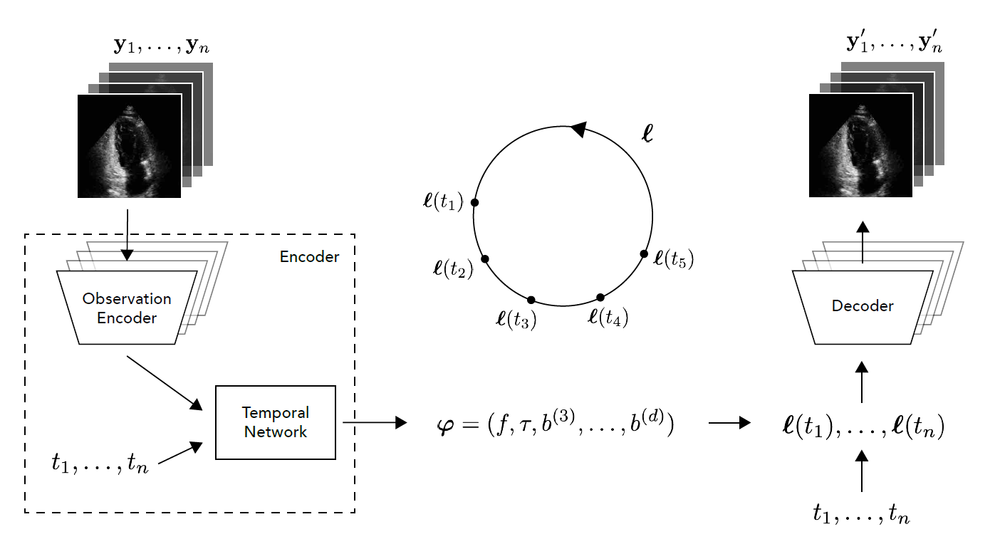

# DeepHeartBeat

by Fabian Laumer, Gabriel Fringeli, Alina Dubatovka, Laura Manduchi, Joachim M. Buhmann

## Introduction
This repository contains the accompanying code to our paper [__DeepHeartBeat: Latent trajectory learning of cardiac cycles using cardiac ultrasounds__](http://proceedings.mlr.press/v136/laumer20a.html), which presents a novel autoencoder-based framework for learning human interpretable representations of cardiac cycles from cardiac ultrasound data.

## Available models

We provide the pre-trained TensorFlow models used in the experiments of our paper, which includes:
- Echocardiogram models trained on the [EchoNet-Dynamic](https://echonet.github.io/dynamic/) dataset
- Single Lead ECG model trained on the [PhysioNet Computing in Cardiology Challenge 2017](https://physionet.org/content/challenge-2017/1.0.0/) dataset

The models can be loaded in the following way:

```
from utils import *

# EchoNet-Dynmaic
model = load_echonet_dynamic_model(i) # with i in [0, 1, 2, 3, 4]

# PhysioNet
model = load_physionet_model()
```

If you are interested in the model architectures and training procedures used for fitting either data type, you may consider the model definitions contained in `models/`.

## Experiments

The folder `experiments/` contains all the code required to reproduce the experiments of the paper. In order to be able to run the experiments you need to place the EchoNet-Dynamic data in the path `data/EchoNet-Dynamic/` and the PhysioNet data in the path `data/physionet.org/`.

The project contains the following experiments:

### Echocardiograms

- `experiments/train_echo.py`: Fits five DeepHeartBeat models to the EchoNet-Dynamic echogram dataset and saves the model weights in `trained_models/`.
- `experiments/eval_echo.py`: Evaluation of the DeepHeartBeat models trained in `experiments/train_echo.py`. This includes heart rate detection, semantic alignment, and the prediction of the ejection fraction of the left ventricle.
- `experiments/rnmf_heart_rates.py`: Heart rate detection for the EchoNet-Dynamic echocardiograms using Rank-2 Robust Non-negative Matrix Factorisation (RNMF).

### Single Lead ECG

- `experiments/train_ecg.py`: Fits a single DeepHeartBeat model to the PhysioNet single lead ECG dataset and saves the model weights in `trained_models/`.
- `experiments/eval_ecg.py`: Evaluation of the DeepHeartBeat model trained in `experiments/train_ecg.py`. This includes anomaly detection (noise detection) and atrial fibrillation (AF) detection.

### Usage

To run any of the experiments you can use the following command:
```
$ python run.py [EXPERIMENT NAME]
```
For example to trun the Echo evaluation you may invoke
```
$ python run.py eval_echo
```


__When using this code, please cite:__

@InProceedings{pmlr-v136-laumer20a,
  title = 	 {DeepHeartBeat: Latent trajectory learning of cardiac cycles using cardiac ultrasounds},
  author =       {Laumer, Fabian and Fringeli, Gabriel and Dubatovka, Alina and Manduchi, Laura and Buhmann, Joachim M.},
  booktitle = 	 {Proceedings of the Machine Learning for Health NeurIPS Workshop},
  pages = 	 {194--212},
  year = 	 {2020},
  editor = 	 {Emily Alsentzer and Matthew B. A. McDermott and Fabian Falck and Suproteem K. Sarkar and Subhrajit Roy and Stephanie L. Hyland},
  volume = 	 {136},
  series = 	 {Proceedings of Machine Learning Research},
  month = 	 {11 Dec},
  publisher =    {PMLR},
  pdf = 	 {http://proceedings.mlr.press/v136/laumer20a/laumer20a.pdf},
  url = 	 {http://proceedings.mlr.press/v136/laumer20a.html}
}

